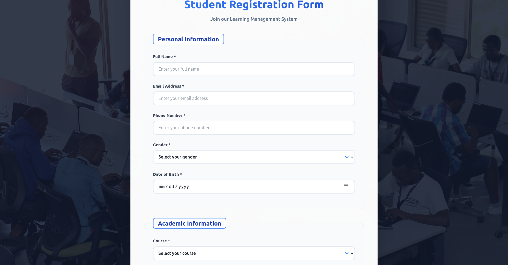

# 📝 React Accessible Form

A modern, accessible, and responsive student registration form built with **React**. This project demonstrates best practices in form validation, user experience, accessibility (WCAG), and deployment via GitHub Pages.

 

---

## 🚀 Live Demo

👉 [https://makebelief.github.io/react-accessible-form](https://makebelief.github.io/react-accessible-form)

---

## ✨ Features

- ✅ Fully accessible with ARIA and semantic HTML
- 💡 Real-time client-side validation with helpful error messages
- 🧑‍🎓 Multi-section form with personal, academic, and account information
- 📱 Responsive design with a sleek, modern UI
- 🌐 Deployed on GitHub Pages for public access
- 🧪 Built-in ESLint support to catch common issues

---

## 🧰 Tech Stack

- [React](https://reactjs.org/)
- [CSS3](https://developer.mozilla.org/en-US/docs/Web/CSS)
- [GitHub Pages](https://pages.github.com/)
- [ESLint](https://eslint.org/) for code linting

---

## 📦 Getting Started

### 1. Clone the Repository

```bash
git clone https://github.com/makebelief/react-accessible-form.git
cd react-accessible-form
```

### 2. Install Dependencies

```bash
npm install
```

### 3. Start the Development Server

```bash
npm start
```

The app will be available at `http://localhost:3000`.

---

## 🚀 Deployment

This app is configured to deploy directly to **GitHub Pages**.

### To Deploy:

```bash
npm run deploy
```

Ensure the `homepage` field in `package.json` is set to:

```json
"homepage": "https://makebelief.github.io/react-accessible-form"
```

---

## 🤝 Contributing

Contributions are welcome! Here's how you can help:

1. Fork the repository
2. Create a feature branch: `git checkout -b feature/my-feature`
3. Commit your changes: `git commit -m "feat: add my new feature"`
4. Push to your branch: `git push origin feature/my-feature`
5. Open a Pull Request

All suggestions and improvements are encouraged!

---

## 👥 Author

**Shayo Victor**  
🧑‍💻 [@makebelief](https://github.com/makebelief)

---

## 📄 License

This project is licensed under the [MIT License](LICENSE).

---
